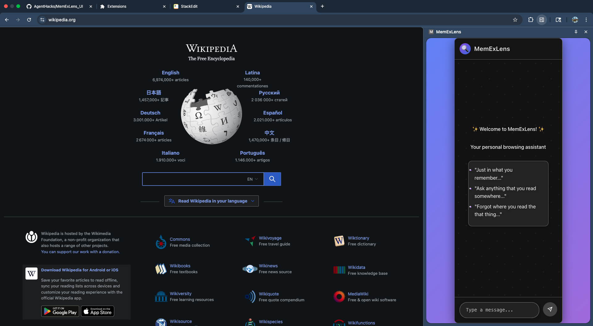
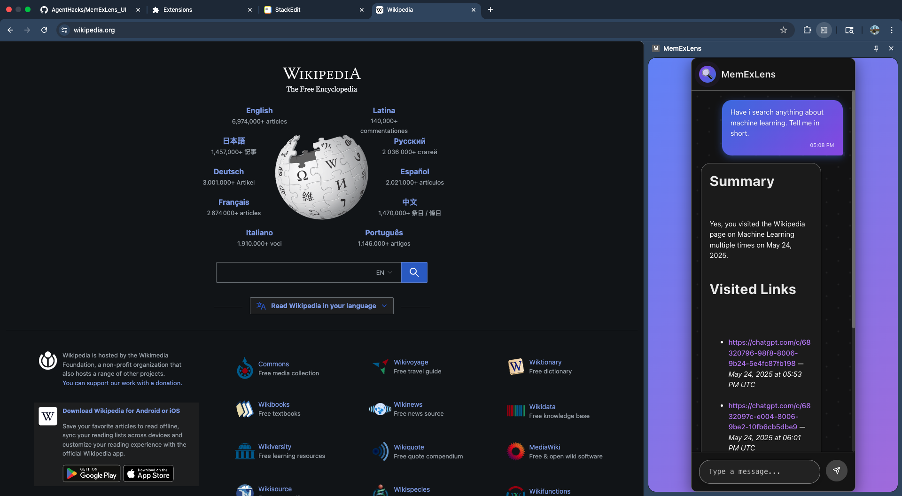
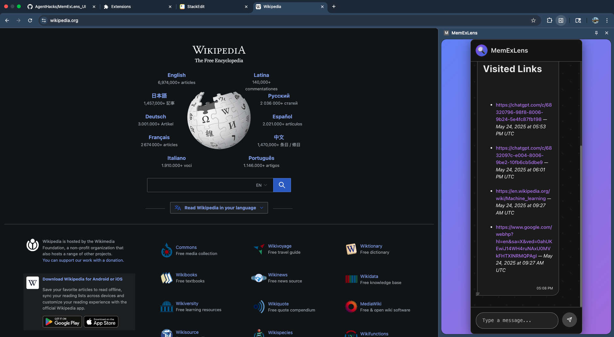

# MemExLens UI - Chrome Extension

## Overview

MemExLens UI is a Chrome extension designed to help users capture, store, and search their browsing history with advanced capabilities. It extracts the main content from web pages you visit, stores it either locally or on a secure server, and allows you to perform semantic searches on this content through a chat interface.

This repository contains the frontend React application for the MemExLens Chrome extension.

## Features

- **Automatic Page Content Capture**: Extracts the primary text content from visited web pages using Mozilla's Readability library.

- **Chat-based Search**: Interact with your stored browsing history via a chat interface. Ask questions or search for keywords, and the extension will retrieve relevant information.

- **Server Storage**: Store your data on a remote server for persistence across devices and more powerful server-side search capabilities (powered by an LLM and vector database).

- **Side Panel Integration**: Access the chat and search functionality conveniently through the browser's side panel.

## How It Works

1.  **Content Extraction (`src/content/content.ts`)**: When you visit a new page (and auto-capture is enabled), the content script extracts the main text using Readability.

2.  **Background Processing (`src/background/background.ts`)**:

- The background script receives the extracted content.

- It stores the content and associated metadata (URL, timestamp).

3.  **Storage**:

- **Server (`src/services/contentServices.ts`, `src/api.ts`)**: If data is sent to a backend API (`https://memexlens-server-171038289672.us-east1.run.app/api/data`).

4.  **Chat Interface (`src/App.tsx`, `src/components/ChatContainer.tsx`, etc.)**:

    - The React-based UI (likely displayed in `sidepanel.html` or a popup) provides a chat window.

    - When you send a message (search query), it's dispatched to the `ChatProvider`.

5.  **Search Functionality**:

    - The `ChatProvider` sends the search query to the `background.ts` script.

    - **Server Search**: `background.ts` calls the `/api/data/user` endpoint (via `src/services/contentServices.ts`) which performs a semantic search using an LLM and vector database on the server.

    - The search results are then displayed in the chat interface.

## Project Structure

```

MemExLens_UI/

├── public/ # Static assets and HTML files (e.g., sidepanel.html, index.html)

├── src/

│ ├── assets/ # CSS, images, etc.

│ │ └── content.ts # Content script for page interaction and text extraction

│ ├── background/

│ │ └── background.ts # Core background script logic for the extension

│ ├── components/ # React UI components

│ │ ├── chat/ # Chat-specific components (Header, Input, MessageItem)

│ │ └── ChatContainer.tsx # Main container for the chat interface

│ │ └── Login.tsx # Login component (presence noted, functionality TBD)

│ │ └── MessageList.tsx # Component to display list of messages

│ │ └── Setting.tsx # Component for user settings

│ ├── content/

│ │ └── content.ts # Content script for page interaction and text extraction

│ ├── context/

│ │ ├── ChatContext.ts # React context for chat state

│ │ └── ChatProvider.tsx # Provider for chat state and actions (including search)

│ ├── hooks/

│ │ └── useChat.ts # Custom hook to access ChatContext

│ ├── reducers/

│ │ └── chatReducer.ts # Reducer for managing chat state

│ ├── services/

│ │ └── contentServices.ts# Service for interacting with the backend API

│ ├── types/ # TypeScript type definitions (chatTypes, storageTypes)

│ ├── api.ts # Axios instance configuration for API calls

│ ├── App.tsx # Root React application component

│ ├── main.tsx # Entry point for the React application

│ └── vite-env.d.ts # Vite environment types

├── .gitignore

├── eslint.config.js # ESLint configuration

├── index.html # Main HTML file (likely for popup or options page)

├── package.json # Project dependencies and scripts

├── README.md # This file

├── sidepanel.html # HTML for the browser side panel UI

├── tsconfig.app.json # TypeScript configuration for the application

├── tsconfig.json # Base TypeScript configuration

├── tsconfig.node.json # TypeScript configuration for Node.js environment (e.g., Vite config)

└── vite.config.ts # Vite build configuration

```

## Key Technologies

- **React**: For building the user interface.

- **TypeScript**: For type safety and improved developer experience.

- **Vite**: For fast frontend development and bundling.

- **Mozilla Readability**: For extracting clean article content from web pages.

- **Axios**: For making HTTP requests to the backend server.

- **Chrome Extension APIs**: `chrome.runtime`, `chrome.storage`, `chrome.tabs`.

- **CSS**: For styling (various .css files noted in `src/assets`).

## Setup and Installation (Development)

1.  **Clone the repository:**

```bash

git clone <repository-url>

cd MemExLens_UI

```

2.  **Install dependencies:**

```bash

npm install

```

3.  **Build the extension:**

```bash

npm run build

```

This will create a `dist` folder with the bundled extension files.

4.  **Load the extension in Chrome:**

- Open Chrome and navigate to `chrome://extensions`.

- Enable "Developer mode" (usually a toggle in the top right).

- Click "Load unpacked".

- Select the `dist` folder from this project.

## How to Use

1. Once installed, the MemExLens extension will (if auto-capture is enabled in settings) start capturing the content of pages you visit.

2. Open the extension (likely via the browser's side panel or the extension icon in the toolbar).

3. Use the chat interface to ask questions or search for terms related to your browsing history.

4. Access settings to configure capture behavior and storage options.

## Screen Shots







## Backend Server

This frontend application interacts with a backend server located at `https://memexlens-server-171038289672.us-east1.run.app`. The backend is responsible for:

- Storing page content.

- Performing semantic search using an LLM and vector database.

(Note: The backend server code is not part of this repository.)

## Contributors

- [aadityaKasbekar](https://github.com/aadityaKasbekar)
- [kartikraut98](https://github.com/kartikraut98)
- [sarthak-deshmukh1999](https://github.com/sarthak-deshmukh1999)

## License

[MIT License](LICENSE)
